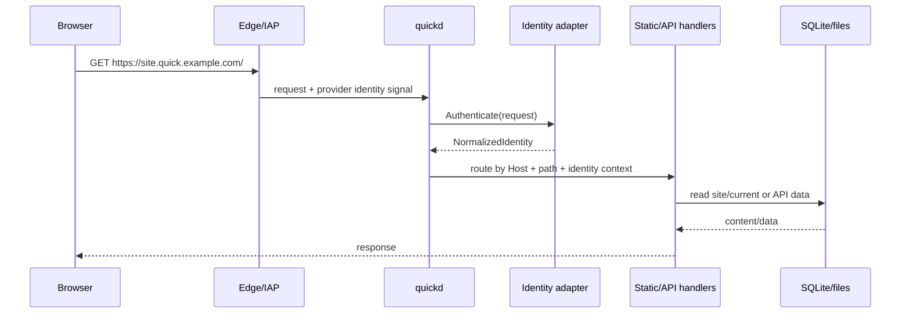

# OpenQuick high-level architecture

Status: design draft  
Audience: implementers deciding the repo split, host daemon, IAP adapters, and v0/v1 boundaries.

## Executive recommendation

Use the existing C23/curspan-derived codebase for the **client CLI** and build a
new **Go host daemon** named `quickd` for serving, identity, deploy activation,
and shared backend APIs.

That split is the pragmatic default:

- The current repo already has the right CLI qualities: small native binary,
  Zig build, table-driven commands, JSON/headless output, diagnostics, and an
  OpenCLI contract.
- The long-running server needs mature HTTP/TLS/WebSocket libraries, safe
  concurrency, easy JWT validation, SQLite integration, and first-class
  Tailscale `tsnet`/LocalAPI support. Go is the best fit.
- Shopify's own Quick moved its server from Node to Go for memory management and
  parallelism; OpenQuick should start there instead of rediscovering that path.
- C23 or Zig for the server would be intellectually attractive but operationally
  worse for v0: more custom HTTP/auth/TLS surface, fewer identity-provider
  libraries, and higher security review cost.

Caddy should be the default public TLS reverse proxy for bare-domain deployments.
For Tailscale Serve and Cloudflare Tunnel, `quickd` can be the direct local
origin behind those products. Static file routing should live in `quickd`, not in
Caddy/NGINX config, so wildcard routing, identity, and backend APIs share one
request pipeline.

## Source references

OpenQuick is inspired by [Shopify Quick's public architecture note](https://shopify.engineering/quick):
folder-backed static sites, wildcard host routing, IAP in front, a small deploy
wrapper, and a single shared backend API surface for DB/uploads/AI/websockets/
identity. Relevant provider behavior to preserve in this design:

- [Tailscale Serve](https://tailscale.com/docs/features/tailscale-serve) can
  proxy local services and add identity headers for tailnet traffic; it does not
  add those headers for public Funnel traffic.
- [Tailscale tsnet](https://tailscale.com/docs/features/tsnet) lets a Go process
  join a tailnet; Tailscale's examples use WhoIs to identify callers.
- [Cloudflare Access JWT validation][cf-access-jwt]
  documents the `Cf-Access-Jwt-Assertion` header and the need to validate issuer,
  audience, and keys.
- [Cloudflare Tunnel](https://developers.cloudflare.com/tunnel/) can publish a
  local origin through outbound-only `cloudflared` connections.
- [Caddy automatic HTTPS](https://caddyserver.com/docs/automatic-https) is the
  recommended bare-domain TLS edge because it automates certificate provisioning
  and renewal, including wildcard certificates with DNS-01.
- [SQLite WAL](https://sqlite.org/wal.html) is the recommended v1 storage mode
  for one-host, mostly-read workloads.

## Component diagram

```mermaid
flowchart LR
    Dev[Developer machine]
    CLI[quick CLI\nC23 + curspan UI]
    SSH[SSH transport]
    RSYNC[rsync]

    subgraph Host[OpenQuick host]
        Edge[IAP / TLS edge\nTailscale Serve or Caddy or cloudflared]
        D[quickd\nGo host daemon]
        Sites[/srv/quick/sites\nreleases + current symlinks]
        DB[(SQLite\nmetadata + document DB)]
        Uploads[/srv/quick/uploads]
        SDK[/_quick/sdk.js]
    end

    Browser[Browser]
    CF[Cloudflare Access]
    TS[Tailscale tailnet]

    Dev --> CLI
    CLI --> SSH
    CLI --> RSYNC
    SSH --> D
    RSYNC --> Sites

    Browser --> CF --> Edge
    Browser --> TS --> Edge
    Browser --> Edge --> D

    D --> Sites
    D --> DB
    D --> Uploads
    D --> SDK
```

Core request path:



## Components

### `quick` CLI: C23 client

Location: existing `src/` tree, renamed from template app to OpenQuick.

Responsibilities:

- parse commands and global flags;
- resolve user-global and per-site config;
- scaffold sites;
- run optional build commands;
- wrap `rsync over SSH` for deploy transfer;
- call remote `quickd` commands over SSH for prepare/activate/list/doctor;
- render concise human output with curspan components;
- emit stable JSON for agents and scripts;
- maintain the OpenCLI contract.

The CLI should not:

- run as the public web server;
- validate Cloudflare JWTs for browser requests;
- hold AI provider keys;
- expose a long-running admin API.

The CLI can be built and released as a single native `quick` binary for macOS and
Linux. Windows support should be removed from project promises unless someone
actively maintains it.

### `quickd`: Go host daemon

Location: `server/cmd/quickd`.

Responsibilities:

- serve static assets from `/srv/quick/sites/<site>/current`;
- route wildcard hosts to site folders;
- provide `/_quick/*` APIs and the JS SDK;
- authenticate every request through an IAP adapter;
- activate deployments atomically;
- maintain the site/deploy catalog;
- enforce quotas and rate limits;
- expose local/SSH-only admin commands for list/doctor/deploy activation.

Recommended Go packages by concern:

| Concern | Direction |
| --- | --- |
| HTTP | standard `net/http`. |
| WebSockets | `nhooyr.io/websocket` or `gorilla/websocket`; prefer `nhooyr` for context-aware API. |
| SQLite | `modernc.org/sqlite` for CGO-free builds or `mattn/go-sqlite3` if CGO is acceptable; choose one early and test release builds. |
| JWT/JWKS | `github.com/go-jose/go-jose/v4` or `github.com/lestrrat-go/jwx/v2`. |
| Tailscale | `tailscale.com/tsnet` and `tailscale.com/client/local`. |
| Config | strict JSON decode with unknown-field rejection. |

Public listener modes:

| Mode | Listener | Edge | Identity source |
| --- | --- | --- | --- |
| `local` | `127.0.0.1:9366` | none | synthetic/dev only. |
| `tailscale-localapi` | localhost behind Caddy on tailnet IP | Caddy/Tailscale network | LocalAPI WhoIs of source IP. |
| `tailscale-serve` | `127.0.0.1:9366` | Tailscale Serve | `Tailscale-User-*` headers. |
| `tailscale-tsnet` | tsnet listener | embedded Tailscale | `LocalClient.WhoIs(r.RemoteAddr)`. |
| `cloudflare-access` | `127.0.0.1:9366` | cloudflared + Access | validated Access JWT. |
| `bare-caddy` | `127.0.0.1:9366` | Caddy | none unless paired with an IAP. |

### Reverse proxy and static serving

Pick **built-in static serving in Go** for site routing, and **Caddy as the TLS
edge** when OpenQuick needs to bind public domains directly.

Why not NGINX as the default:

- Dynamic wildcard routing and shared APIs are easier in application code.
- NGINX config generation/reload becomes another failure mode.
- Caddy has better defaults for automatic HTTPS and certificate lifecycle.

Why not Caddy-only static serving:

- Identity normalization and `/_quick/*` APIs must happen in one request
  pipeline.
- Hostname-to-site routing needs to consult OpenQuick site metadata and reserved
  names.
- Deploy activation and site catalog should not depend on proxy reloads.

Recommended Caddy role:

```text
*.quick.example.com, quick.example.com
  tls { dns <provider> }
  reverse_proxy 127.0.0.1:9366
```

For Cloudflare Tunnel, `cloudflared` can route directly to `quickd`; Caddy is not
needed unless the operator wants a local TLS hop. For Tailscale Serve, Serve can
route directly to `quickd` and provide identity headers.

## Host directory layout

Use one root, default `/srv/quick`:

```text
/srv/quick/
  config/
    quickd.json                  # host config copy or symlink from /etc/openquick
  data/
    quick.db                     # SQLite catalog + document DB
    quick.db-wal
    quick.db-shm
  sites/
    lunch-vote/
      site.json                  # public-ish metadata for this site
      deploy.lock
      current -> releases/20260611T135901Z-a1b2c3
      previous -> releases/20260610T090000Z-deadbeef
      releases/
        20260611T135901Z-a1b2c3/
          index.html
          assets/app.js
          .quick-release.json
      .incoming/
        20260611T135901Z-a1b2c3/
          files/
          rsync.log
  uploads/
    lunch-vote/
      2026/06/<object-id>
  logs/
    quickd.log
```

Do not put live files directly under `/srv/quick/sites/<site>/current` as a real
directory. `current` should be a symlink to an immutable release directory.

### Permissions

Recommended v0 permissions:

```text
quick:quick            owns quickd process and /srv/quick
quick-deploy           group allowed to trigger deploys
/srv/quick             0750 quick:quick
/srv/quick/sites       2770 quick:quick-deploy
/srv/quick/data        0750 quick:quick
/srv/quick/uploads     0750 quick:quick
```

Deployment accounts:

- Simple mode: everyone deploys as SSH user `quick`; audit uses SSH key comments
  and client-provided deploy metadata.
- Better org mode: individual Unix accounts are members of `quick-deploy`, and
  forced SSH commands call `quickd deploy-*` as the `quick` user.
- Best later mode: SSH certificates with deploy principals; `quickd` records the
  principal in the deploy audit log.

Preserve the no-owner product stance by avoiding per-site filesystem ownership.
Use audit and rollback for accountability, not ACLs.

## Deployment story without a bucket

OpenQuick replaces “bucket + gcsfuse” with “staging directory + release symlink.”
The deployment protocol has three phases.

### 1. Prepare

The CLI calls over SSH:

```bash
quickd deploy prepare --site lunch-vote --json
```

`quickd`:

- validates the site slug;
- checks reserved names;
- creates the site directory if absent;
- acquires or checks `deploy.lock`;
- creates `.incoming/<deploy-id>/files`;
- returns the staging path and optional `link_dest` path.

### 2. Transfer

The CLI runs `rsync` to staging:

```bash
rsync -az \
  --delete \
  --partial-dir=.rsync-partial \
  --safe-links \
  --chmod=Dg+s,ug+rwX,o-rwx \
  --link-dest=/srv/quick/sites/lunch-vote/current \
  ./dist/ quick@quickbox:/srv/quick/sites/lunch-vote/.incoming/<deploy-id>/files/
```

Transfer semantics:

- `--delete` mirrors the local output tree.
- Staging is not served, so interrupted deploys are invisible.
- Partial files stay inside staging.
- Symlinks that escape the release are rejected.
- Hard-links via `--link-dest` keep releases cheap when assets are unchanged.

### 3. Activate

The CLI calls:

```bash
quickd deploy activate --site lunch-vote --deploy-id <id> --json
```

`quickd`:

- reacquires `deploy.lock`;
- validates the staging tree;
- writes `.quick-release.json`;
- renames `.incoming/<id>/files` to `releases/<release-id>`;
- atomically swaps `current` using symlink rename;
- records the deploy in SQLite;
- prunes old releases.

Atomicity guarantee: an HTTP request sees either the previous complete release or
the next complete release. It never sees an rsync-in-progress tree.

## IAP adapter abstraction

All request handlers should depend on one normalized identity type, never on
provider-specific headers or JWT claims.

```go
type Identity struct {
    Authenticated bool              `json:"authenticated"`
    Provider      string            `json:"provider"` // tailscale, cloudflare, dev, anonymous
    Subject       string            `json:"subject"`
    Email         string            `json:"email,omitempty"`
    Login         string            `json:"login,omitempty"`
    Name          string            `json:"name,omitempty"`
    AvatarURL     string            `json:"avatar_url,omitempty"`
    Groups        []string          `json:"groups,omitempty"`
    Device        string            `json:"device,omitempty"`
    Capabilities  map[string]any    `json:"capabilities,omitempty"`
    Raw           map[string]string `json:"-"` // audit/debug only; never returned by default
}

type Adapter interface {
    Name() string
    Authenticate(ctx context.Context, r *http.Request) (*Identity, error)
}
```

Adapter errors should be typed:

| Error | HTTP |
| --- | --- |
| missing credential | 401 |
| invalid credential | 403 |
| provider unavailable | 503 |
| anonymous not allowed | 401 |
| misconfigured adapter | 500 on startup / unhealthy doctor |

`quickd` should strip or ignore all inbound `X-Quick-*` identity headers. Only
adapter code may place identity into request context.

### Tailscale designs

Support three Tailscale transport modes, but recommend `localapi` or `serve` for
v0 and keep `tsnet` as a first-class Go path.

#### `tailscale-localapi` mode

Best for true wildcard subdomain URLs on a private tailnet with a custom domain.

Topology:

```text
Browser on tailnet -> https://site.quick.example.com -> Caddy bound to Tailscale IP -> quickd localhost
```

Identity flow:

1. Caddy receives the tailnet client connection.
2. Caddy proxies to `quickd` on localhost and preserves source IP in
   `X-Forwarded-For`.
3. `quickd` trusts `X-Forwarded-For` only because the immediate peer is in
   `trusted_proxies`.
4. `quickd` calls Tailscale LocalAPI WhoIs for that Tailscale IP.
5. The adapter maps login/name/avatar/device/groups into `Identity`.

Hard requirements:

- Caddy must not listen on a public interface unless another IAP is in front.
- `quickd` must reject forwarded identity/source headers from non-trusted peers.
- Tailnet ACLs must allow intended viewers to reach the host.

#### `tailscale-serve` mode

Best for simple private hosting with the fewest moving parts.

Topology:

```text
Browser on tailnet -> https://quick.<tailnet>.ts.net -> Tailscale Serve -> quickd localhost
```

Identity flow:

- Tailscale Serve injects `Tailscale-User-Login`, `Tailscale-User-Name`, and
  `Tailscale-User-Profile-Pic` for tailnet traffic.
- `quickd` trusts those headers only from localhost.
- If configured, app capabilities can be accepted from `Tailscale-App-Capabilities`.

Trade-off:

- Pure Serve gives a great private URL for the host, but not arbitrary wildcard
  subdomains under `*.ts.net`. OpenQuick should offer path fallback:
  `https://quick.<tailnet>.ts.net/~/<site>/` unless custom domain/TLS is added.

#### `tailscale-tsnet` mode

Best for a single `quickd` binary joining a tailnet without relying on a host
`tailscaled` daemon.

Topology:

```text
Browser on tailnet -> tsnet listener in quickd
```

Identity flow:

- `quickd` creates a `tsnet.Server`.
- HTTP listener accepts tailnet traffic.
- Adapter calls `LocalClient.WhoIs(r.RemoteAddr)`.
- Optional TLS uses Tailscale certificate integration for the machine DNS name.

Trade-off:

- Great Go-native integration.
- Same wildcard caveat as Serve for pure `*.ts.net` names.
- Requires tsnet state/auth-key lifecycle management.

#### Funnel

Funnel is a transport for exposing a service to the broader internet. It is not
an identity-aware private boundary for OpenQuick by itself.

OpenQuick should treat Funnel as:

- `iap.type = none` unless paired with another auth layer;
- suitable for temporary public previews;
- not suitable for the default “trusted users only” product promise.

If a user explicitly enables Funnel, `quick doctor` must warn when identity APIs
would return anonymous users.

### Cloudflare Access design

Topology:

```text
Browser -> Cloudflare Access -> Cloudflare Tunnel -> quickd localhost
```

Configuration:

```json
{
  "iap": {
    "type": "cloudflare",
    "team_domain": "https://example.cloudflareaccess.com",
    "audience": "<Application AUD tag>",
    "jwks_url": "https://example.cloudflareaccess.com/cdn-cgi/access/certs",
    "email_domain_allowlist": ["example.com"]
  }
}
```

Authentication flow:

1. Read `Cf-Access-Jwt-Assertion` from the request.
2. Fetch/cache JWKS from the team domain.
3. Validate signature algorithm, `kid`, issuer, audience, expiry, and not-before.
4. Extract `sub`, `email`, `name`, and group/custom claims if configured.
5. Return normalized `Identity`.

Security requirements:

- Never trust `Cf-Access-Authenticated-User-Email` without validating the JWT.
- Cache JWKS but refresh on unknown `kid`.
- Restrict the origin so requests cannot bypass Cloudflare Access.
- Require the Access app to cover both the apex control hostname and wildcard
  site hostnames.

### Local/no-IAP dev mode

`iap.type = none` is valid only when `quickd` binds to loopback. It should return:

```json
{
  "authenticated": false,
  "provider": "anonymous",
  "subject": "anonymous"
}
```

With `quick serve --dev --identity sam@example.com`, return a synthetic dev
identity:

```json
{
  "authenticated": true,
  "provider": "dev",
  "subject": "dev:sam@example.com",
  "email": "sam@example.com",
  "login": "sam@example.com",
  "name": "Sam"
}
```

The synthetic identity must be visibly marked as dev and rejected on non-loopback
listeners.

## Identity injection into hosted sites

Hosted sites should never parse IAP headers directly. The stable interface is:

```http
GET /_quick/identity
```

Response:

```json
{
  "authenticated": true,
  "provider": "cloudflare",
  "subject": "cloudflare:abc123",
  "email": "sam@example.com",
  "login": "sam@example.com",
  "name": "Sam Example",
  "avatar_url": "https://...",
  "groups": ["engineering"]
}
```

The JS SDK should cache identity for the page lifetime and expose:

```js
const me = await quick.identity.current();
quick.identity.onChange((identity) => console.log(identity));
```

For server-rendered static files, `quickd` may optionally inject a tiny bootstrap
script into HTML responses later, but v0 should avoid response rewriting. Keep it
explicit and cacheable via `/_quick/sdk.js`.

## Backend APIs

### Minimal v0

Ship v0 with:

- static hosting;
- atomic deploys;
- list/open/doctor;
- `/_quick/health`;
- `/_quick/identity`;
- `/_quick/sdk.js` exposing identity and feature detection.

This is enough to validate the deployment and IAP architecture before adding
stateful APIs.

### v1 shared backend

Add:

1. document DB;
2. realtime subscriptions over WebSocket;
3. file uploads;
4. identity-aware audit/rate limits.

Use one SQLite database per host, not per site, in v1:

```sql
sites(id, name, subdomain, created_at, updated_at, last_release_id)
deploys(id, site_id, release_id, deployer, bytes, files, created_at)
documents(site_id, collection, id, data_json, created_by, updated_by, created_at, updated_at)
uploads(site_id, id, path, content_type, size, created_by, created_at)
rate_limits(scope, key, window_start, count)
```

SQLite settings:

```sql
PRAGMA journal_mode=WAL;
PRAGMA foreign_keys=ON;
PRAGMA busy_timeout=5000;
```

WAL is a good fit for this scale: many readers, small writes, one host. If a
single OpenQuick host grows beyond SQLite's comfortable write concurrency, the
right next step is a managed Postgres adapter, not premature distributed state.

### Document DB API

HTTP shape:

```http
GET    /_quick/db/:collection
POST   /_quick/db/:collection
GET    /_quick/db/:collection/:id
PUT    /_quick/db/:collection/:id
PATCH  /_quick/db/:collection/:id
DELETE /_quick/db/:collection/:id
```

All records are implicitly namespaced by site and authenticated identity.

SDK:

```js
const posts = quick.db.collection('posts');

const created = await posts.create({
  title: 'Hello OpenQuick',
  status: 'draft',
  created_at: new Date().toISOString(),
});

const post = await posts.get(created.id);
await posts.update(created.id, { status: 'published' });

const unsubscribe = await posts.subscribe({
  onCreate: (doc) => console.log('created', doc),
  onUpdate: (doc) => console.log('updated', doc),
  onDelete: (id) => console.log('deleted', id),
});
```

Default auth model for v1:

- any authenticated viewer can read/write a site's DB;
- anonymous dev mode can read/write only on loopback;
- per-site rules are deferred.

This mirrors the Quick philosophy. It is intentionally not Firebase Security
Rules in v1.

### Realtime API

Use one WebSocket endpoint:

```http
GET /_quick/realtime
```

Message envelope:

```json
{
  "type": "subscribe",
  "channel": "db:posts",
  "since": "optional-cursor"
}
```

SDK:

```js
const room = quick.realtime.channel('lunch-room');
room.on('cursor', (msg) => renderCursor(msg));
room.send('cursor', { x: 120, y: 90 });
```

The server should enforce per-site connection limits and per-identity message
rate limits from day one.

### Uploads API

HTTP:

```http
POST   /_quick/uploads
GET    /_quick/uploads/:id
DELETE /_quick/uploads/:id
```

SDK:

```js
const upload = await quick.uploads.put(file, { name: file.name });
const url = upload.url;
```

Storage:

```text
/srv/quick/uploads/<site>/<yyyy>/<mm>/<object-id>
```

Metadata lives in SQLite. Files are served only through `quickd` so identity,
site namespace, content type, and range requests are enforced consistently.

### AI proxy

Defer AI to v2 because it introduces cost, abuse, provider secrets, and policy.
When added:

```js
const res = await quick.ai.chat([
  { role: 'user', content: 'Summarize these notes' }
]);
```

Server requirements before enabling AI:

- host-level provider keys only;
- per-site and per-identity rate limits;
- budget caps;
- audit logs;
- provider allowlist;
- no arbitrary base URL by default.

### Data warehouse

Defer to v2/enterprise. A warehouse proxy is valuable, but it is the highest-risk
API because it bridges private analytics data into arbitrary static sites. It
should require explicit host configuration and query allowlists.

## Client JS SDK shape

Load from same origin:

```html
<script type="module">
  import { quick } from '/_quick/sdk.js';

  const me = await quick.identity.current();
  const votes = quick.db.collection('votes');
  await votes.create({ choice: 'ramen', by: me.email });
</script>
```

Top-level API:

```ts
export const quick = {
  identity: {
    current(): Promise<Identity>;
    onChange(cb: (identity: Identity) => void): () => void;
  },
  db: {
    collection(name: string): Collection;
  },
  uploads: {
    put(file: File | Blob, options?: UploadOptions): Promise<Upload>;
    get(id: string): Promise<Upload>;
    remove(id: string): Promise<void>;
  },
  realtime: {
    channel(name: string): Channel;
  },
  ai: {
    chat(messages: ChatMessage[], options?: ChatOptions): Promise<ChatResponse>;
  },
  capabilities(): Promise<Capabilities>;
};
```

`quick.capabilities()` lets generated sites adapt to v0/v1/v2 hosts without
crashing.

## Subdomain and TLS story

### Cloudflare Tunnel + Access

Recommended for easiest public DNS and organization login:

```text
*.quick.example.com  -> Cloudflare proxied DNS
cloudflared ingress  -> http://127.0.0.1:9366
Access app           -> *.quick.example.com
TLS                  -> Cloudflare-managed edge TLS
Identity             -> Cf-Access-Jwt-Assertion validated by quickd
```

Pros:

- no inbound ports required on the origin;
- Cloudflare manages public TLS;
- wildcard subdomains are natural;
- Access policies are familiar to many organizations.

Risks:

- origin bypass must be impossible;
- wildcard Access app must actually cover all site hostnames;
- JWT validation is mandatory at origin.

### Tailscale private hosting

There are two good variants.

#### Tailscale with custom wildcard domain

```text
*.quick.example.com -> resolves for tailnet clients to host Tailscale IP
Caddy               -> wildcard cert via DNS-01, bound to Tailscale interface
quickd              -> localhost origin
Identity            -> LocalAPI WhoIs(source Tailscale IP)
```

Pros:

- real subdomain URLs;
- private tailnet reachability;
- identity from tailnet;
- no Cloudflare dependency.

Risks:

- DNS setup is more advanced;
- wildcard ACME requires DNS provider credentials;
- if Caddy accidentally binds publicly, the IAP boundary is weakened.

#### Pure Tailscale Serve/tsnet

```text
https://quick.<tailnet>.ts.net/~/<site>/
```

Pros:

- simplest setup;
- Tailscale handles HTTPS for the machine name;
- Serve identity headers or tsnet WhoIs are straightforward.

Trade-off:

- pure `*.ts.net` is not a good fit for arbitrary site subdomains; use path
  fallback or add a custom domain.

### Bare VPS with own domain

```text
*.quick.example.com -> A/AAAA to VPS
Caddy               -> wildcard cert via DNS-01 or restricted on-demand TLS
quickd              -> localhost origin
IAP                 -> required unless explicitly public
```

Recommended only when paired with Cloudflare Access, Tailscale, oauth2-proxy, or
another future adapter. OpenQuick's default should reject `iap=none` on public
interfaces.

Caddy on-demand TLS should be restricted with an `ask` endpoint if used; do not
let arbitrary hostnames trigger certificate issuance.

### Local dev

```text
http://<site>.localhost:9366
http://localhost:9366/~/<site>/ fallback
```

No TLS by default. `iap=none` allowed only on loopback. Synthetic identity is opt
in.

## Security model

### Threat model shift from Shopify Quick

Shopify's Quick assumes a trusted internal employee environment. OpenQuick runs
on arbitrary hosts and may use a tailnet or Cloudflare Access org as the only
wall. That changes the security bar.

Assume:

- any hosted site can contain malicious JavaScript;
- any authenticated viewer may intentionally or accidentally abuse backend APIs;
- deployers can overwrite other sites by design;
- public internet scanners will hit any exposed origin;
- provider headers can be spoofed if the origin is reachable directly;
- AI and uploads create cost and storage abuse risk.

### Required hardening

Request/auth hardening:

- deny all requests when `iap.require_identity = true` and no valid identity is
  present;
- validate Cloudflare JWTs at the origin;
- trust Tailscale Serve headers only from loopback;
- trust `X-Forwarded-For` only from configured local proxies;
- strip inbound provider identity headers before proxying where possible;
- reject direct origin requests in `cloudflare-access` mode unless they include a
  valid Access JWT.

Static file hardening:

- resolve paths without following `..` out of the release;
- reject symlinks that escape the release;
- serve dotfiles only if explicitly allowed;
- set `X-Content-Type-Options: nosniff`;
- use safe cache headers: immutable for hashed assets, no-cache for HTML;
- do not execute uploaded files or CGI-like content.

API hardening:

- same-origin CORS only;
- require `Origin`/`Host` consistency for state-changing browser requests;
- use CSRF tokens or double-submit cookies for cookie-authenticated APIs if
  provider cookies are ambient across subdomains;
- per-site and per-identity rate limits;
- maximum request body sizes;
- JSON depth/size limits;
- upload content-type sniffing and size quotas;
- audit all deploys and high-cost API calls.

Deployment hardening:

- stage then activate; never rsync into live directories;
- per-site deployment locks;
- reserved site names;
- release retention and rollback path;
- deploy audit includes SSH user/key/principal, local hostname, CLI version, and
  release hash;
- host commands should avoid shell interpolation of site names and paths.

Secret handling:

- AI/provider keys live only in host config or a host secret manager;
- never expose raw IAP tokens to sites;
- redact secrets from `doctor` output;
- file permissions keep `/srv/quick/data` and config unreadable by deploy-only
  users.

### Cross-site isolation

Subdomains are an important boundary. Prefer:

```text
https://site-a.quick.example.com
https://site-b.quick.example.com
```

over path-only hosting because browser storage, service workers, and cookies are
better isolated per host.

Path fallback is acceptable for pure Tailscale Serve/local dev, but it is a lower
isolation mode and should be labeled as such in `doctor`.

## Repo structure proposal

Starting point is a curspan C23 CLI/TUI template. Keep the useful CLI machinery,
but reshape the repo around OpenQuick.

Recommended layout:

```text
.
  build.zig
  build.zig.zon
  opencli.json
  src/                         # C23 quick CLI
    main.c
    quick.h                    # renamed umbrella, or keep curspan vendored internally
    cli/
      commands.c
      commands_init.c
      commands_deploy.c
      commands_serve.c
      commands_open.c
      commands_list.c
      commands_doctor.c
      commands_opencli.c
    core/
      config.c
      site_config.c
      profile_config.c
      deploy_plan.c
    io/
    ui/
    style/
    surface/
    components/                # curspan-derived output components
    tui/                       # optional diagnostics/setup TUI
    utils/
  server/                      # Go quickd module
    go.mod
    cmd/quickd/main.go
    internal/
      api/
      config/
      deploy/
      identity/
        adapter.go
        cloudflare.go
        tailscale_localapi.go
        tailscale_serve.go
        tailscale_tsnet.go
        dev.go
      sites/
      static/
      store/
      realtime/
      uploads/
      ratelimit/
  sdk/
    js/
      package.json
      src/index.ts
      dist/quick.js            # embedded or copied into quickd release
  install/
    systemd/openquick.service
    caddy/Caddyfile.example
    cloudflared/config.example.yml
    tailscale/serve.example.sh
  docs/
    design/
      PROJECT_BRIEF.md
      WORKFLOW.md
      ARCHITECTURE.md
    user/
      quick-init.md
      quick-deploy.md
      iap-cloudflare.md
      iap-tailscale.md
      sdk.md
  examples/
    sites/
      blank/
      realtime-vote/
      uploads/
  test/
    ... existing C CLI tests ...
  server_test/
    ... Go integration tests, or keep under server/internal/... ...
```

### What to keep from curspan

Keep:

- Zig build for the C CLI;
- table-driven command metadata;
- `opencli.json` contract generation/checking;
- JSON output conventions;
- `doctor` pattern;
- terminal styling, tables, notes, and optional TUI;
- unit/contract/PTY test layers where still relevant.

### What to rename

Rename:

- binary/app metadata from `myapp`/`Curspan` to `quick`/`OpenQuick`;
- config env vars from `APP_*` to `QUICK_*`;
- user config path from `myapp` to `openquick`;
- command examples and OpenCLI contract;
- docs that describe the app rather than the vendored UI framework.

The `cs_` component namespace can remain internally for now. It is already
vendored source. Renaming every UI primitive is lower-value than shipping v0.

### What to delete or move out of the product path

Delete or quarantine before the first OpenQuick release:

- template cleanup machinery under `.template/`;
- curspan component registry CLI if it ships in the main binary;
- Windows/PDCurses docs and CI promises unless support is actively maintained;
- generic examples that teach adding `hello`/`echo` once equivalent OpenQuick
  command examples exist;
- badges and README text pointing at Curspan.

Do not delete the component source used by the CLI output; just stop presenting
OpenQuick as a component framework.

## Build and release strategy

v0 can have two build systems:

- `zig build` for the C CLI;
- `go build ./server/cmd/quickd` for the host daemon;
- `just build` or CI glue builds both.

Later, `build.zig` may invoke Go as a system command for release packaging, but
forcing Go into Zig's build graph on day one is not worth the complexity.

Release artifacts:

```text
quick-darwin-arm64
quick-darwin-amd64
quick-linux-amd64
quick-linux-arm64
quickd-linux-amd64
quickd-linux-arm64
checksums.txt
SBOMs
```

Host installer should download both `quick` and `quickd` only if needed. A server
operator can run `quickd` without installing the interactive CLI, but keeping
`quick` available on the host helps diagnostics.

## Phased roadmap

### v0: static hosting + deploy

Goal: validate the deployment and edge model.

Deliver:

- rename CLI to `quick`;
- `quick init` static scaffold;
- user/global and per-site config;
- `quick serve install` for Linux/systemd and local foreground;
- `quickd` static host router;
- rsync staging + atomic release activation;
- Caddy bare-domain template;
- Tailscale localapi/Serve identity proof-of-concept;
- Cloudflare Access JWT validation proof-of-concept;
- `/_quick/identity` and `/_quick/health`;
- `quick deploy`, `quick open`, `quick list`, `quick doctor`;
- release retention and deploy audit.

Cut scope:

- no DB;
- no uploads;
- no AI;
- no warehouse;
- no per-site owners.

### v1: identity + DB/realtime/uploads

Goal: make OpenQuick useful for internal tools, polls, dashboards, and small
collaborative apps.

Deliver:

- production-ready Tailscale and Cloudflare adapters;
- stable normalized Identity API;
- JS SDK v1;
- SQLite document DB;
- WebSocket realtime subscriptions;
- upload API with file storage;
- quotas and rate limits;
- backup/export command for SQLite and uploads;
- integration tests for cross-site isolation and provider auth.

### v2: AI proxy and richer platform APIs

Goal: match the “AI-era internal tool” use case without making v1 unsafe.

Deliver:

- AI chat/image proxy with host-managed keys;
- budgets and per-identity rate limits;
- provider allowlists;
- optional warehouse query proxy with allowlisted datasets/queries;
- admin dashboard/TUI for host health, deploys, storage, and rate limits;
- custom domain automation and restricted Caddy on-demand TLS;
- optional owner/namespace mode for organizations that outgrow the pure
  no-owner model.

### v3: scale/HA only if needed

Do not design for multi-region scale early. The charm of Quick is that one VM can
serve a surprising amount of mostly-static traffic. Add complexity only when a
real OpenQuick deployment proves it needs it.

Possible v3 work:

- Postgres storage adapter;
- object storage adapter for uploads;
- multi-host deploy replication;
- signed release manifests;
- background jobs;
- SSH certificate integration;
- external audit log sinks.

## Implementation notes for the first PR series

1. Rename product metadata and README from Curspan to OpenQuick.
2. Add `docs/design/WORKFLOW.md` and `docs/design/ARCHITECTURE.md`.
3. Add `quick init` with scaffold + tests + OpenCLI update.
4. Add config structs for `quick.json` and user profiles.
5. Add deploy planner that prints JSON but does not transfer yet.
6. Add Go `quickd` skeleton with `/health`, static file handler, and host config.
7. Add `quick deploy --dry-run`, then real prepare/rsync/activate.
8. Add one IAP path end-to-end; recommend Cloudflare Access first for wildcard
   subdomain validation, then Tailscale localapi/Serve.

Keep each step shippable and contract-tested. The riskiest parts are identity
trust and deploy atomicity; prove those before adding backend APIs.

[cf-access-jwt]: https://developers.cloudflare.com/cloudflare-one/access-controls/applications/http-apps/authorization-cookie/validating-json/
