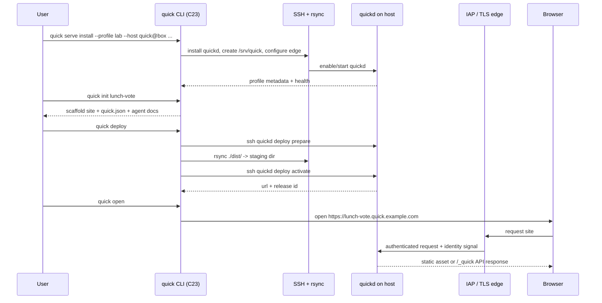
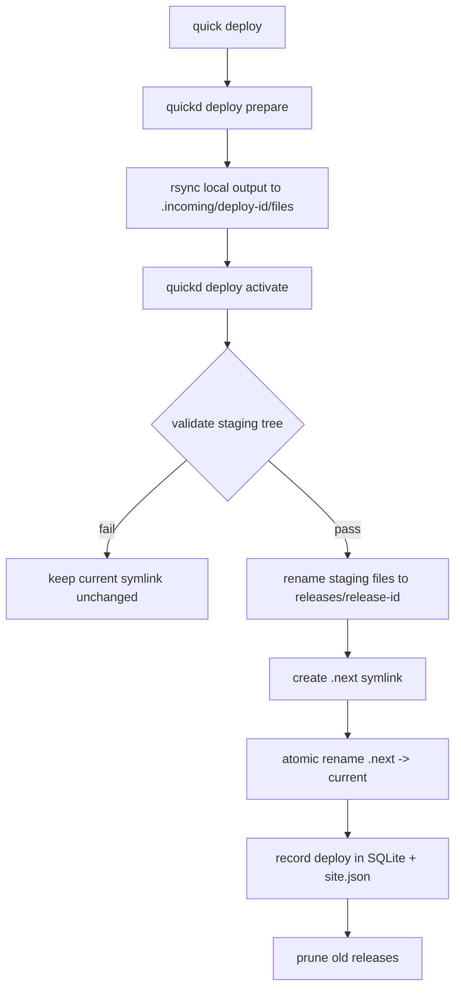

# OpenQuick workflow design

Status: design draft  
Audience: CLI/server implementers and early operators  
Scope: user-visible workflows, config, deployment semantics, and the trust model for OpenQuick.

## Product stance

OpenQuick should feel like the original Quick idea: drop a folder of HTML/assets,
get a private URL, and let the site use a small shared backend without provisioning
its own infrastructure. The implementation should differ in one important way:
the deployment target is any machine reachable by SSH and `rsync`, not a cloud
bucket or a specific provider.

The default operating model is:

1. One host runs `quickd`, the OpenQuick host-side daemon.
2. Users deploy static assets with `quick deploy`, which wraps `rsync over SSH`; quickd serves precompressed `.br`/`.gz` variants when clients advertise matching `Accept-Encoding`.
3. Sites are addressed by deterministic subdomains, usually
   `https://<site>.<base-domain>`.
4. Every request passes through an identity-aware edge before it reaches the
   site or backend APIs.
5. Authenticated users inside the configured trust boundary can view every site;
   users with deploy access can overwrite every site.

This keeps the product simple. There are deployment profiles and coarse
host-level safety knobs, but there are no per-site owners in the default mode.

## End-to-end lifecycle



The first interaction with a host is setup. After that, the happy path should be
`quick init`, edit files, `quick deploy`, `quick open`.

## Command surface

The curspan template already gives this project a table-driven C23 CLI, global
flags, JSON/headless output, `doctor`, and an OpenCLI contract. Keep that shape:
each workflow below should have both human output and a stable JSON envelope when
`--json` is passed or stdout is not a TTY.

Current top-level commands:

| Command | Purpose |
| --- | --- |
| `quick init [dir]` | Scaffold a static site and the local OpenQuick metadata. |
| `quick templates` | List bundled templates, generated files, and SDK API demos. |
| `quick deploy [path]` | Build if needed, transfer a folder or ZIP to the selected host, and atomically publish it. `--dry-run` includes added/changed/deleted/excluded transfer categories and calls out destructive deletes; transfer failures report the phase, cleanup status, and retry guidance. |
| `quick serve ...` | Install, start, or run the host-side server; also supports local dev mode and remote API proxy mode. |
| `quick open [site]` | Open or print the resolved URL for a site. |
| `quick list` | List sites known locally or on a remote host, with `--filter` and deterministic `--sort` metadata in JSON. |
| `quick config show` | Show resolved config, profile, target, URL, and source precedence. |
| `quick delete SITE` | Delete a remote site after typed confirmation or `--yes`, archiving it for recovery. |
| `quick restore SITE` | Restore a recently deleted site from the archive path printed by delete. |
| `quick public SITE [on/off]` | Show or change a site's public-static flag. |
| `quick domain add/remove/list` | Manage custom domains in the host catalog; list includes DNS/TLS readiness status and remediation. |
| `quick doctor` | Validate local tooling, config, SSH, host health, IAP, DNS, and TLS. |
| `quick opencli` | Existing machine-readable command contract. |
| `quick rollback SITE` | Restore the previous or selected release for a site after confirmation. |

Do not add a command per backend feature. Backend APIs belong in the JS SDK and
`quickd`; the CLI should stay focused on site lifecycle and host operations.
Host-side mutation commands append audit events that can be exported with
`quickd audit export --json`; metadata redacts secret-like keys. The
TUI wraps the same workflows; main-menu descriptions and Help must expose the
matching CLI commands for users who prefer non-fullscreen or screen-reader
workflows. Settings/profile edits must warn on Back when changes are still in
memory and offer save, discard, or cancel so users do not lose work by
navigation alone. Deploy cancellation must surface cleanup status: remote staging
cleaned, or the exact staging path and cleanup guidance when it remains.

## `quick init`

`quick init` creates a folder that an AI agent or a human can immediately edit
and deploy.

### Invocation

```bash
quick init                  # initialize current directory
quick init lunch-vote       # create ./lunch-vote
quick init --template blank
quick init --template realtime lunch-vote
quick init --name lunch-vote --profile lab
```

### Defaults

- Site name defaults to the directory basename, normalized as a DNS label:
  lowercase ASCII, `a-z0-9-`, no leading/trailing hyphen, max 63 characters.
- If a global default profile exists, `quick init` records that profile name in
  `quick.json`. If not, it leaves deployment unbound and local dev still works.
- The scaffold is static HTML by default. No framework is required.
- The SDK is referenced as `/_quick/sdk.js`, served by `quickd` at runtime.

### Generated files

For a new site:

```text
lunch-vote/
  index.html
  quick.json
  AGENTS.md
  docs/
    openquick-api.md
  .quickignore
```

Recommended `quick.json` v1:

```json
{
  "$schema": "https://openquick.dev/schemas/site.v1.json",
  "name": "lunch-vote",
  "source": ".",
  "output": ".",
  "build": null,
  "profile": "lab",
  "subdomain": "lunch-vote",
  "sdk": {
    "enabled": true,
    "import": "/_quick/sdk.js"
  }
}
```

For a generated app with a build step:

```json
{
  "$schema": "https://openquick.dev/schemas/site.v1.json",
  "name": "lunch-vote",
  "source": ".",
  "output": "dist",
  "build": "bun run build",
  "profile": "lab",
  "subdomain": "lunch-vote"
}
```

`AGENTS.md` should explain the constraints in agent-friendly language:

- produce static files in `output`;
- use `/_quick/sdk.js` for identity, DB, realtime, uploads, AI, and warehouse when the host advertises those capabilities;
- do not create custom servers;
- do not store API keys in client code;
- run `quick deploy` after changing the site.

`docs/openquick-api.md` should be copied from the SDK docs for the current host
version when possible. If no host is configured, include the latest bundled API
reference.

`.quickignore` uses gitignore-style patterns and is applied before deployment.
Default entries:

```gitignore
.git/
.quick/
node_modules/
.DS_Store
.env
.env.*
```

The `.quick/` directory is local state only and should not be committed. It can
hold last deploy metadata, cached remote host capabilities, and generated dry-run
plans.

## `quick deploy`

`quick deploy` is the core workflow. It should behave like a safe, opinionated
`rsync` wrapper, not like a build platform.

### Invocation

```bash
quick deploy                         # deploy current site using quick.json
quick deploy ./dist --site demo       # deploy a folder directly
quick deploy site.zip --site demo     # upload ZIP and extract on the host
quick deploy --profile lab            # override profile
quick deploy --site lunch-vote        # override site/subdomain
quick deploy --dry-run                # show transfer and activation plan
quick deploy --no-build               # skip quick.json build command
quick deploy --no-delete              # do not mirror deletions into the release
quick deploy --yes                    # non-interactive overwrite confirmation
quick deploy --open                   # open the URL after activation
```

### Target resolution

Resolution order is intentionally boring:

1. CLI flags.
2. Environment variables: `QUICK_PROFILE`, `QUICK_SITE`, `QUICK_REMOTE`,
   `QUICK_BASE_DOMAIN`.
3. Per-site `quick.json`.
4. User-global config.
5. Built-in local dev defaults.

`quick deploy` resolves:

| Value | Source | Notes |
| --- | --- | --- |
| `site` | `--site`, `quick.json.name`, directory name | DNS-label slug. |
| `subdomain` | `--subdomain`, `quick.json.subdomain`, `site` | Usually equal to site. |
| `profile` | `--profile`, `quick.json.profile`, global default | Selects host/IAP/domain. |
| `ssh` | profile | SSH alias or `user@host`. |
| `remote_root` | profile | Defaults to `/srv/quick`. |
| `base_domain` | profile | If set, URL is `https://<subdomain>.<base_domain>`. |
| `base_url` | profile | For path fallback or non-wildcard transports. |
| `iap` | profile | `tailscale`, `cloudflare`, or `none`. |

Example resolved deployment target:

```text
site:        lunch-vote
profile:     lab
ssh:         quick@quickbox
remote root: /srv/quick
staging:     /srv/quick/sites/lunch-vote/.incoming/20260611T135901Z-a1b2c3
url:         https://lunch-vote.quick.example.com
```

### Build step

If `quick.json.build` is non-null and `--no-build` is not set:

1. run the command in `quick.json.source`;
2. require the output directory to exist;
3. deploy only `quick.json.output`.

The CLI does not infer frameworks. It may print helpful hints, but it should not
run package managers unless the site explicitly asks.

### First deploy bootstrap

On the first deploy to a profile, the CLI checks the remote host:

```bash
ssh quick@quickbox quickd doctor --json
```

Outcomes:

| Result | CLI behavior |
| --- | --- |
| `quickd` healthy | Continue. |
| SSH works but `quickd` missing | Print the exact `quick serve install ...` command. If `--bootstrap` is passed, run it. |
| `/srv/quick` missing or not writable | Fail with remediation. |
| IAP/domain not configured | Allow deploy only if `--allow-unpublished`; otherwise fail before transfer. |

The first site deployment creates:

```text
/srv/quick/sites/lunch-vote/
  site.json
  deploy.lock
  releases/
  .incoming/
  current -> releases/<release-id>
```

Before activation, the URL can 404. It must never serve a partially transferred
tree.

### Subsequent deploys

Subsequent deploys reuse the previous release for transfer efficiency:

```bash
rsync -az \
  --delete \
  --partial-dir=.rsync-partial \
  --safe-links \
  --chmod=Dg+s,ug+rwX,o-rwx \
  --link-dest=/srv/quick/sites/lunch-vote/current \
  ./dist/ quick@quickbox:/srv/quick/sites/lunch-vote/.incoming/<deploy-id>/files/
```

Notes:

- `--delete` is the default because a deploy should mirror the local output.
- `--delete` applies to the staging directory, not the live `current` release.
- `--no-delete` exists for emergency/manual migrations, not normal use.
- `--link-dest` hard-links unchanged files from the current release when possible,
  reducing disk use and transfer time.
- `--safe-links` prevents deployed symlinks from pointing outside the release.
- `--checksum` should be an opt-in flag for pathological mtime/size cases; it is
  too slow as a default.
- If the last deployer differs from the current deployer, `quick deploy` prints
  the last deployer/release and requires typing the site name or passing `--yes`.
- When `[path]` is a `.zip`, the CLI uploads it and calls
  `quickd deploy extract-zip`; extraction rejects encrypted archives, symlinks,
  absolute/traversal paths, duplicate entries, and excessive size/counts before
  normal activation.

### Activation and atomicity

Activation is a host-side operation performed by `quickd` over SSH, not by the
client constructing shell snippets.



`quickd deploy activate` should:

1. acquire `deploy.lock` with `flock` or equivalent;
2. validate that staging is under the site directory;
3. reject missing `index.html` unless `site.json.spa_fallback` explicitly allows
   a different entry;
4. write a release manifest containing file count, total bytes, content hash,
   deployer, source host, and available SSH certificate metadata; sign it when
   `deploy.signing` is enabled;
5. rename the complete staging tree into `releases/<release-id>` on the same
   filesystem;
6. atomically swap `current` by creating a new symlink and renaming it over the
   old one;
7. retain the last N releases, default 10;
8. leave failed staging directories for debugging for 24 hours, then garbage
   collect them.

Rollback is not in the requested v0 command list, but the layout should make a
future `quick rollback <site> <release>` a symlink swap plus an audit record.

### Deploy output

Human output:

```text
quick deploy lunch-vote
  profile     lab
  host        quick@quickbox
  files       18 changed, 71 reused, 2 deleted
  release     20260611T135901Z-a1b2c3
  url         https://lunch-vote.quick.example.com
```

JSON output:

```json
{
  "format_version": "1.0",
  "site": "lunch-vote",
  "profile": "lab",
  "release": "20260611T135901Z-a1b2c3",
  "url": "https://lunch-vote.quick.example.com",
  "changed": 18,
  "reused": 71,
  "deleted": 2
}
```

## `quick serve` and host setup

`quick serve` covers two related workflows:

1. install/configure/start `quickd` on a real host;
2. run a local dev server for the current site.

Keep both under one command because users should not need to know whether they
are interacting with the C23 client, the Go server binary, systemd, Caddy, or
cloudflared.

### Fresh VM bootstrap

Recommended remote bootstrap from the developer machine:

```bash
quick serve install \
  --profile lab \
  --host quick@quickbox \
  --remote-root /srv/quick \
  --domain quick.example.com \
  --iap tailscale
```

Equivalent direct-host bootstrap:

```bash
sudo quick serve install \
  --remote-root /srv/quick \
  --domain quick.example.com \
  --iap cloudflare
```

Installer responsibilities:

1. create a `quick` system user and `quick-deploy` group;
2. create `/srv/quick` with `0750` root and group-writable deployment subtrees;
3. install `quickd` to `/usr/local/bin/quickd`;
4. write `/etc/openquick/quickd.json`;
5. install and enable the system service;
6. configure the selected edge/IAP;
7. run `quickd doctor --host --json`;
8. write or update the local user profile in `~/.config/openquick/config.json`.

For Linux servers, default to systemd. For macOS and ad-hoc local machines, run
foreground by default and add launchd later if needed.

### Host config generated by install

```json
{
  "$schema": "https://openquick.dev/schemas/host.v1.json",
  "listen": "127.0.0.1:9366",
  "public_base_domain": "quick.example.com",
  "remote_root": "/srv/quick",
  "data_dir": "/srv/quick/data",
  "retained_releases": 10,
  "max_upload_bytes": 104857600,
  "iap": {
    "type": "tailscale",
    "mode": "localapi",
    "trusted_proxies": ["127.0.0.1/32"],
    "source_ip_header": "X-Forwarded-For"
  },
  "deploy": {
    "policy": "any_ssh_deployer",
    "reserved_names": ["api", "admin", "www", "_quick"]
  }
}
```

### IAP-specific install modes

#### Tailscale profile

Recommended private Tailscale subdomain setup:

- `quickd` listens on localhost.
- Caddy listens on the Tailscale interface or on localhost behind Tailscale Serve.
- Wildcard DNS points `*.quick.example.com` to the host in a way tailnet clients
  can resolve to the Tailscale address.
- Caddy obtains a wildcard certificate with ACME DNS-01.
- `quickd` derives identity by calling Tailscale LocalAPI/WhoIs for the real
  client Tailscale IP passed by the trusted local proxy.

This is the best way to get true `https://<site>.<domain>` URLs on Tailscale.
Pure `*.ts.net` certificates are machine-name oriented, not arbitrary wildcard
site names, so a pure Tailscale Serve setup should use a path fallback unless the
operator provides custom DNS/TLS.

Simpler Tailscale Serve setup:

```bash
tailscale serve --bg https / http://127.0.0.1:9366
```

In this mode, `quickd` may trust Tailscale's identity headers only because it is
listening on localhost and Serve strips spoofed incoming identity headers before
proxying.

Tailscale Funnel is not a trusted identity boundary. Funnel is useful for public
previews, but public Funnel traffic does not carry tailnet user identity. If a
site needs trusted identities, use Serve/tsnet/localapi inside the tailnet or pair
Funnel with another IAP.

#### Cloudflare profile

Recommended Cloudflare setup:

- `cloudflared` runs on the host and maps `*.quick.example.com` to
  `http://127.0.0.1:9366`.
- Cloudflare Access protects the wildcard application.
- `quickd` validates the `Cf-Access-Jwt-Assertion` JWT on every request.
- The origin is not publicly reachable except through the tunnel.

Installer can either:

1. operate in guided mode and print Cloudflare dashboard steps; or
2. use an API token with Cloudflare Tunnel and DNS permissions to create/update
   the tunnel config.

Do not require Cloudflare API automation in v0. Guided mode is enough as long as
`quick doctor` can verify the resulting headers/JWT.

#### Bare VPS profile

Bare VPS means public internet plus your own domain. It is acceptable only when
paired with an IAP adapter or an explicit decision to run public/anonymous.

Recommended edge:

- Caddy listens on `:80` and `:443`;
- wildcard DNS points `*.quick.example.com` at the VPS;
- Caddy obtains a wildcard certificate using DNS-01 or individual certificates
  with restricted on-demand TLS;
- Caddy proxies to `quickd` on localhost;
- an IAP sits in front or `quickd` rejects requests when `iap.type != none`.

Do not default to naked public static hosting. It violates the product promise.

### Local dev server

```bash
quick serve --dev              # serve current quick.json locally
quick serve --dev --port 9366
quick serve --dev --identity sam@example.com
quick serve --dev --remote-api lunch-vote --profile lab
```

Local dev mode:

- binds to `127.0.0.1` by default;
- serves the current site from the local filesystem;
- uses `iap.type = none`;
- returns a synthetic identity only if `--identity` is provided;
- uses `http://<site>.localhost:<port>` when the browser resolves `*.localhost`,
  otherwise falls back to `http://localhost:<port>/~/<site>/`;
- with `--remote-api <site>`, serves local static files but forwards `/_quick/*`
  to the selected deployed site through the configured profile, clearly showing
  the remote target and logging remote API use as the authenticated developer.

`iap=none` must be rejected for non-loopback bind addresses unless
`--allow-public-unsafe` is explicitly passed.

## `quick open`

`quick open` resolves the canonical URL and opens it in the default browser, or
prints it in `--plain`/non-TTY mode.

```bash
quick open                 # current site
quick open lunch-vote      # named site in selected/default profile
quick open --profile lab
quick open --copy          # copy URL to clipboard where supported
```

Resolution order:

1. `.quick/deployments/<profile>.json` in the current site;
2. remote `quickd sites get <site> --json` over SSH;
3. deterministic `https://<subdomain>.<base_domain>` from config;
4. path fallback from `base_url`.

If the site has never been deployed, print the target URL and clearly mark it as
not yet live.

## `quick list`

`quick list` should answer “what is on this host?” without requiring a web admin
UI.

```bash
quick list
quick list --profile lab
quick list --remote
quick list --json
```

Default behavior:

- If inside a site directory, show local deployments for that site first.
- If a default profile exists, query the remote host over SSH.
- If SSH is unavailable, fall back to local cache and mark rows stale.

Human output:

```text
site            url                                      updated              by
lunch-vote      https://lunch-vote.quick.example.com      2026-06-11 13:59    sam
ops-dashboard   https://ops-dashboard.quick.example.com   2026-06-10 09:14    alex
```

The remote implementation should read from `quickd`'s SQLite catalog, not walk
the filesystem on every request.

## `quick doctor`

`quick doctor` is the command that prevents “it deployed but I can’t open it”
time sinks.

```bash
quick doctor                         # local + current profile
quick doctor --profile lab
quick doctor --remote
quick doctor --site lunch-vote
quick doctor --deep                  # includes a temporary test deploy
quick doctor --json
```

Checks should be grouped and actionable.

Local checks:

- `quick` version and OpenCLI contract version;
- `rsync` present;
- `ssh` present and can resolve selected profile alias;
- `quick.json` schema valid;
- build output exists or build command succeeds;
- site name is a legal DNS label;
- `.quickignore` parsed.

Remote checks:

- SSH connects;
- `quickd` exists and version is compatible;
- `/srv/quick` permissions are correct;
- staging and releases are on the same filesystem;
- enough disk space;
- system service is running;
- SQLite opens in WAL mode;
- configured release retention and GC are sane.

Edge/IAP checks:

- base domain resolves as expected;
- TLS certificate covers the resolved hostname;
- Caddy/cloudflared/Tailscale mode is reachable;
- Cloudflare Access JWT validates with expected issuer/audience;
- Tailscale identity headers or WhoIs work from a test request;
- direct origin access is not possible when an IAP is configured;
- `/_quick/identity` returns the normalized identity shape.

Deep check:

1. create a temporary site name like `_doctor-<random>`;
2. deploy a one-file static site;
3. request it through the public URL;
4. request `/_quick/identity`;
5. delete or hide the temporary site.

Because `_quick` and underscore-prefixed names are reserved, the deep-check site
should live in a reserved diagnostics namespace that cannot collide with user
sites.

## Config model

Use JSON for v0 because the existing C23 template already has a JSON config
reader and the OpenCLI/headless surfaces are JSON. Add comments later only if the
parser supports them safely.

### User-global config

Path:

```text
$XDG_CONFIG_HOME/openquick/config.json
~/.config/openquick/config.json
```

Example:

```json
{
  "$schema": "https://openquick.dev/schemas/user.v1.json",
  "default_profile": "lab",
  "profiles": {
    "lab": {
      "ssh": "quick@quickbox",
      "remote_root": "/srv/quick",
      "base_domain": "quick.example.com",
      "base_url": "https://quick.example.com",
      "iap": {
        "type": "tailscale",
        "mode": "localapi"
      },
      "deploy": {
        "delete": true,
        "open_after_deploy": false
      }
    },
    "cf": {
      "ssh": "quick@cf-box",
      "remote_root": "/srv/quick",
      "base_domain": "quick.internal.example.com",
      "iap": {
        "type": "cloudflare",
        "team_domain": "https://example.cloudflareaccess.com",
        "audience": "<access-aud-tag>"
      }
    },
    "local": {
      "ssh": null,
      "remote_root": ".quick/local-server",
      "base_url": "http://localhost:9366/~",
      "iap": { "type": "none" }
    }
  }
}
```

Global config owns machine/user choices:

- SSH alias or host;
- remote root;
- base domain/base URL;
- IAP type and provider metadata;
- default deploy behavior;
- optional paths to `rsync`, `ssh`, and browser opener.

It should not contain site names except local deployment cache.

### Per-site config

`quick.json` owns project choices:

- site name and subdomain;
- source/output directory;
- build command;
- desired profile;
- SPA fallback behavior;
- SDK enabled/disabled;
- optional quotas if host policy allows site-level quotas.

Example with SPA fallback:

```json
{
  "$schema": "https://openquick.dev/schemas/site.v1.json",
  "name": "planning-board",
  "output": "dist",
  "build": "bun run build",
  "profile": "lab",
  "subdomain": "planning-board",
  "routing": {
    "spa_fallback": "/index.html"
  }
}
```

Do not put secrets in `quick.json`. It is expected to be committed.

### Local state

Path inside a site:

```text
.quick/
  deployments/
    lab.json
  cache/
    host-capabilities-lab.json
```

Example deployment record:

```json
{
  "profile": "lab",
  "site": "lunch-vote",
  "url": "https://lunch-vote.quick.example.com",
  "release": "20260611T135901Z-a1b2c3",
  "deployed_at": "2026-06-11T13:59:01Z"
}
```

`.quick/` is intentionally uncommitted. It accelerates `quick open` and improves
offline diagnostics, but it must never be the source of truth.

## Zero-config goal

Zero-config means “after one host bootstrap, a new site should not need to know
about hosts, buckets, TLS, IAP, or backend URLs.”

Practical rules:

- `quick serve install` writes a default profile.
- `quick init` uses the default profile if one exists.
- `quick deploy` can infer site name from the directory.
- URLs are deterministic from profile + site name.
- The SDK is always same-origin at `/_quick/sdk.js`.
- The identity API always has the same JSON shape regardless of IAP provider.

It does not mean the first host setup is magic. Cloudflare Access and DNS-01
certificates need provider-specific setup; OpenQuick should make that setup
copy-pasteable and diagnosable.

## “No owners, anyone can overwrite” in OpenQuick

Shopify's Quick can lean on a known internal employee boundary. OpenQuick cannot
assume that. The equivalent boundary is the configured IAP plus SSH deploy
access.

### Default philosophy

- Every authenticated viewer inside the IAP can view every site.
- Every deployer with SSH access to the host can overwrite every site.
- Last successful deploy wins.
- There are no per-site owners, ACLs, or approval flows in v0.
- There is audit and rollback-friendly history even though there are no owners.

This is intentionally not the same as “anyone on the internet can deploy.” Deploy
rights are controlled by SSH, not by browser identity.

### Trust boundary mapping

| Environment | Viewer boundary | Deployer boundary | Recommended default |
| --- | --- | --- | --- |
| Tailscale personal tailnet | Tailnet ACLs / device shares | SSH users/keys on host | Open, no owners. |
| Tailscale company tailnet | Tailnet groups/ACLs | SSH CA or `quick-deploy` group | Open within trusted group. |
| Cloudflare Access org | Access application policy | SSH users/keys on origin | Open within Access policy. |
| Homelab local-only | LAN or loopback | Local Unix user | Use `iap=none` only on loopback. |
| Public VPS without IAP | Internet | SSH users/keys | Do not allow by default. |

### Knobs to expose

Keep knobs coarse and host-level:

```json
{
  "deploy": {
    "policy": "any_ssh_deployer",
    "reserved_names": ["api", "admin", "www", "_quick"],
    "require_confirm_for_reserved_prefixes": true,
    "retained_releases": 10,
    "audit": true,
    "signing": { "enabled": true, "required": false },
    "require_ssh_cert": false
  },
  "viewer": {
    "require_identity": true,
    "allow_anonymous": false
  },
  "public_static": { "enabled": false },
  "http_deploy": {
    "enabled": false,
    "tokens": [],
    "allow_identities": []
  },
  "ai": {
    "enabled": false,
    "default_provider": "",
    "providers": [],
    "limits": {
      "requests_per_minute_per_identity": 20,
      "requests_per_day_per_site": 2000,
      "max_request_bytes": 1048576
    }
  },
  "warehouse": {
    "enabled": false,
    "queries": []
  },
  "dev_proxy": { "enabled": false }
}
```

Do expose:

- reserved site names;
- deployer audit, SSH certificate metadata, and signed manifests;
- release retention;
- global write policy (`any_ssh_deployer`, later `admins_only`);
- IAP required/anonymous dev mode and explicit remote API proxy mode;
- public-static and HTTP deploy gates that default off;
- AI and warehouse gates with host-managed credentials, model/query allowlists,
  rate/budget limits, and query catalogs;
- quotas/rate limits.

Do not expose:

- per-site owners;
- per-site viewer ACLs;
- custom backends;
- arbitrary server-side code;
- public anonymous hosting as a one-flag accident; use explicit `public_static`
  plus the static-only scan.

Owner/namespace and per-site ACL modes are rejected for this product line unless
a later assessment reverses [DEFERRED_ASSESSMENT.md](./DEFERRED_ASSESSMENT.md).

## Related references

- [Shopify Quick](https://shopify.engineering/quick) for the original internal
  platform shape and product philosophy.
- [rsync man page](https://linux.die.net/man/1/rsync) for transfer flags and
  mirroring semantics.
- [Tailscale Serve](https://tailscale.com/docs/features/tailscale-serve),
  [Tailscale tsnet](https://tailscale.com/docs/features/tsnet), and
  [Tailscale HTTPS certificates](https://tailscale.com/docs/how-to/set-up-https-certificates)
  for the Tailscale deployment modes.
- [Cloudflare Tunnel](https://developers.cloudflare.com/tunnel/) and
  [Cloudflare Access JWT validation][cf-access-jwt]
  for the Cloudflare deployment mode.
- [Caddy automatic HTTPS](https://caddyserver.com/docs/automatic-https) for bare
  domain TLS and wildcard certificate behavior.

[cf-access-jwt]: https://developers.cloudflare.com/cloudflare-one/access-controls/applications/http-apps/authorization-cookie/validating-json/
